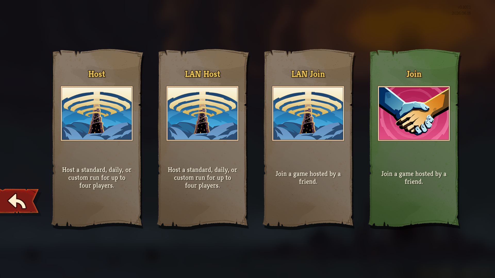
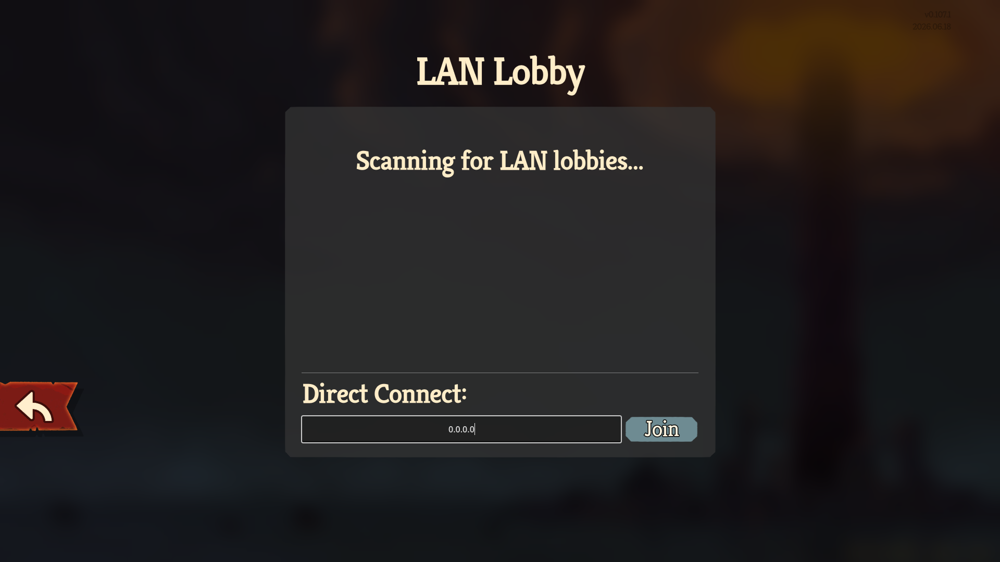
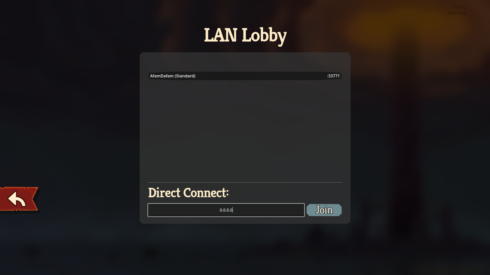
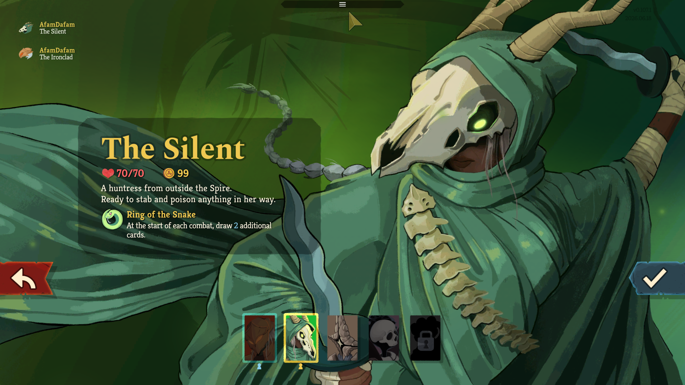

# STS2 LAN Multiplayer

Play **Slay the Spire 2** with friends on the same local network.


# Images







## How it works

- Adds **LAN Multiplayer** buttons to the multiplayer menu
- Host opens a port and shares their local IP; friends type it in and connect
- Automatic LAN discovery — nearby hosts appear in the join list automatically
- Works entirely within your LAN — no internet, no accounts, no relay needed


## Installation

1. Download the latest release `.zip` from the [Releases](../../releases) page
2. Extract and place the `SlayTheSpire2.LAN.Multiplayer` folder into your STS2 `mods/` directory:

```
Slay the Spire 2/
└── mods/
    └── SlayTheSpire2.LAN.Multiplayer/
        ├── mod.json
        └── SlayTheSpire2.LAN.Multiplayer.dll
```

3. Launch STS2 


## How to play

### Host

1. Open **Multiplayer** → **LAN Host**
2. Choose a game mode (Standard / Daily / Custom)
3. Share your local IP address shown on screen with your friends
4. Wait for them to connect

Your machine needs UDP port **33771** reachable from the other players. On the same Wi-Fi this works automatically. Across different networks you need port forwarding or a tunnel like [playit.gg](https://playit.gg).

### Join

1. Open **Multiplayer** → **LAN Join**
2. Nearby hosts appear in the list automatically — click to connect
3. Or type the host's IP directly in the **Direct Connect** field


## Settings

Accessible from **Multiplayer** → **LAN Settings**:

| Setting | Default | Description |
|---|---|---|
| **Player Name** | Steam name | Your display name in the session |
| **Host Port** | 33771 | UDP port the host listens on |
| **Max Players** | 4 | Maximum players when hosting |
| **Net ID** | 1000 | Internal network identifier |


## Compatibility

- Slay the Spire 2 (Early Access)
- Both players must be on the same game version
- Compatible with [STS2 Public Lobby](https://github.com/adamsyuhky/STS2.PublicLobby) — install both simultaneously


## Building from source

See [building.md](docs/building.md).


## Credits

This mod is a fork of [SlayTheSpire2.LAN.Multiplayer](https://github.com/kmyuhkyuk/SlayTheSpire2.LAN.Multiplayer) by **kmyuhkyuk**.

Changes in this fork:
- Added Separate UI Menu for LAN Lobby
- Support for STS2 Version 0.107.1


## License

GPL-3.0 — see [LICENSE.txt](LICENSE.txt).

This project is a derivative of [SlayTheSpire2.LAN.Multiplayer](https://github.com/kmyuhkyuk/SlayTheSpire2.LAN.Multiplayer) (GPL-3.0) by kmyuhkyuk.
